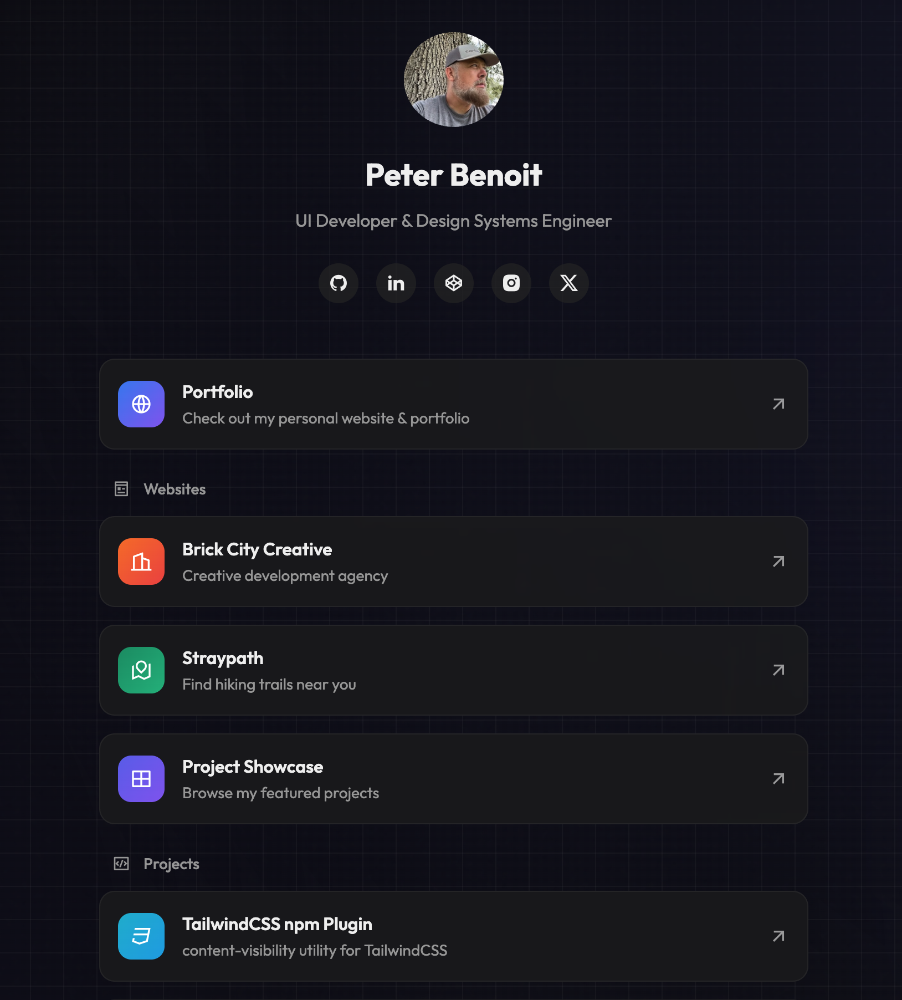

# 🔗 UIGuy Links Landing Page

A stylish, customizable "link in bio" landing page built with HTML, CSS, and Vite. This project provides a self-hosted alternative to services like Linktree or Bio.link with full customization options.



## ✨ Features

-   **Modern Design** - Clean, dark-mode interface with animations and hover effects
-   **Responsive** - Looks great on all devices from mobile to desktop
-   **Customizable** - Easy to modify colors, layout, and content
-   **Self-Hosted** - Host it yourself with complete control over your data
-   **Performance Focused** - Fast loading with minimal dependencies
-   **Background Effects** - Subtle gradient, noise texture, and animated shapes
-   **Interactive Elements** - Hover effects and tooltips for better user experience

## 🛠️ Technologies

-   HTML5 & CSS3
-   Minimal vanilla JavaScript
-   [Vite](https://vitejs.dev/) for building and development
-   [Remix Icons](https://remixicon.com/) for beautiful icons
-   Canvas Confetti for interactive effects

## 🚀 Getting Started

### Prerequisites

-   Node.js (version 14.x or higher)
-   npm or yarn

### Installation

1. Clone this repository

    ```bash
    git clone https://github.com/peterbenoit/uiguy.dev.git
    cd uiguy.dev
    ```

2. Install dependencies

    ```bash
    npm install
    ```

3. Start the development server

    ```bash
    npm run dev
    ```

4. Open your browser at `http://localhost:5173`

## 🎨 Customization

### Profile Information

Edit the profile section in `index.html`:

```html
<div class="profile">
    <div class="profile-avatar">
        
    </div>
    <h1 class="profile-name">Your Name</h1>
    <p class="profile-bio">Your Title or Tagline</p>
    <!-- Social icons... -->
</div>
```

### Link Cards

Add or modify link cards by following this structure:

```html
<a href="https://yourdomain.com" class="link-card custom-class">
    <div class="link-icon">
        <i class="ri-icon-name-here"></i>
    </div>
    <div class="link-content">
        <h2>Link Title</h2>
        <p>Link description goes here</p>
    </div>
    <div class="link-arrow">
        <i class="ri-arrow-right-up-line"></i>
    </div>
</a>
```

### Colors and Styling

Customize colors by editing the CSS variables in `links.css`:

```css
:root {
    --color-bg: #050505;
    --color-text: #f0f0f0;
    --color-text-secondary: #a0a0a0;
    --color-accent: #4f46e5;
    --color-accent-light: #6366f1;
    /* More variables... */
}
```

## 📦 Building for Production

Build the project for production:

```bash
npm run build
```

The built files will be in the `dist` directory, ready to deploy to any static hosting service.

## 🌐 Deployment

This project can be deployed to any static site hosting service:

-   [Netlify](https://netlify.com)
-   [Vercel](https://vercel.com)
-   [GitHub Pages](https://pages.github.com)
-   [Cloudflare Pages](https://pages.cloudflare.com)

Example deployment to Netlify:

1. Push your repository to GitHub
2. Connect your GitHub account to Netlify
3. Select your repository
4. Set the build command to `npm run build`
5. Set the publish directory to `dist`

## 🔧 Project Structure

```
/
├── index.html            # Main HTML structure
├── links.css             # Styling for the landing page
├── links.js              # JavaScript functionality
├── vite.config.js        # Vite configuration
├── package.json          # Project dependencies
└── README.md             # Project documentation
```

## 🤝 Contributing

Contributions, issues, and feature requests are welcome! Feel free to check the [issues page](https://github.com/peterbenoit/uiguy.dev/issues).

## 📄 License

This project is licensed under the MIT License - see the [LICENSE](LICENSE) file for details.

## 🙏 Acknowledgements

-   [Remix Icons](https://remixicon.com/) for the beautiful icon set
-   [Canvas Confetti](https://github.com/catdad/canvas-confetti) for celebration effects
-   [Vite](https://vitejs.dev/) for the fast build tool

## 👨‍💻 Author

**Peter Benoit**

-   [GitHub](https://github.com/peterbenoit)
-   [Website](https://peterbenoit.com)
-   [CodePen](https://codepen.io/peterbenoit)
